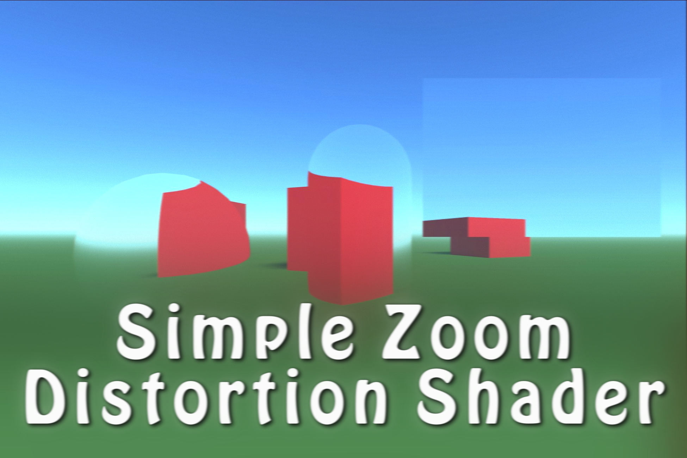
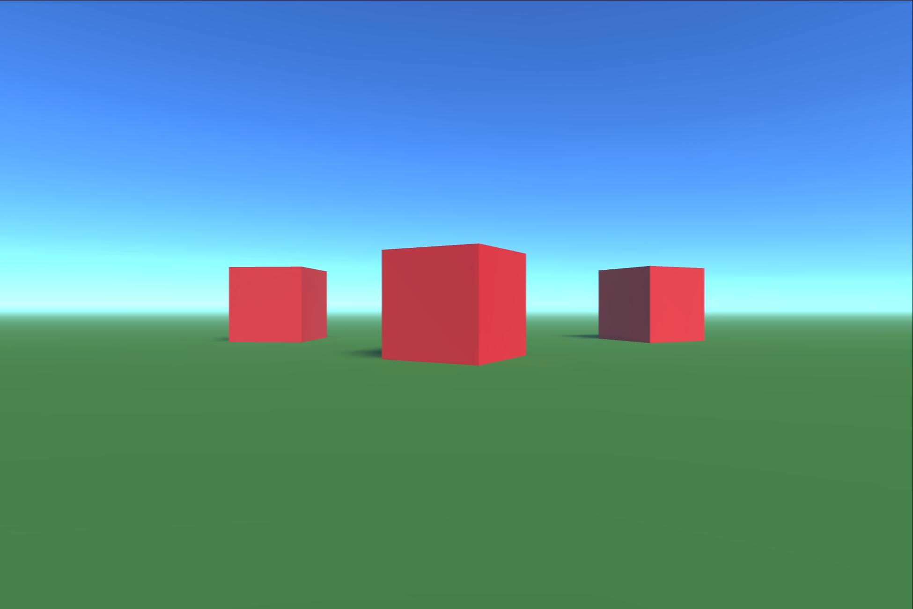
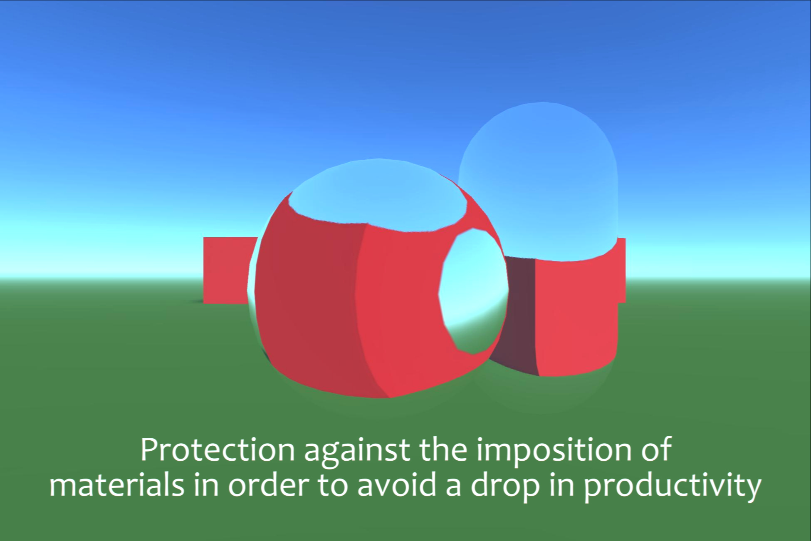
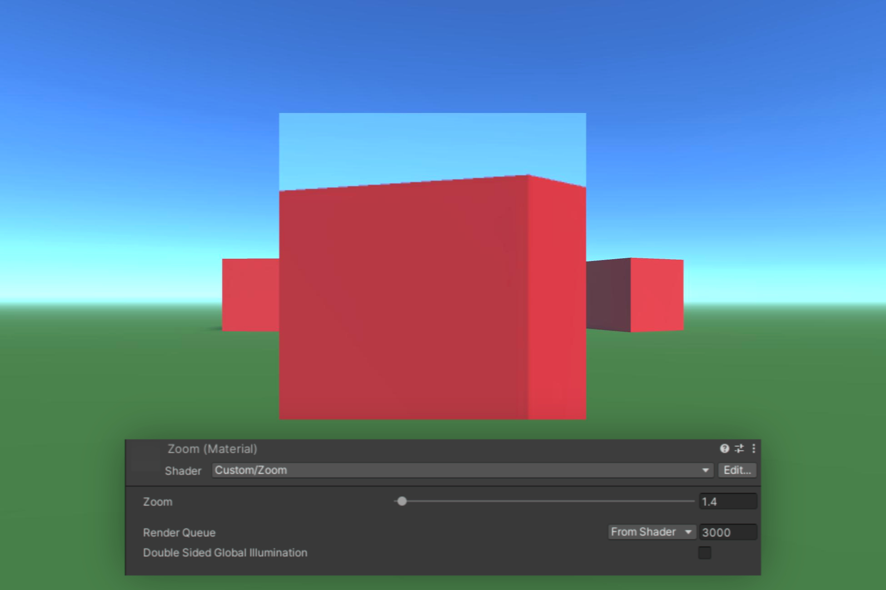
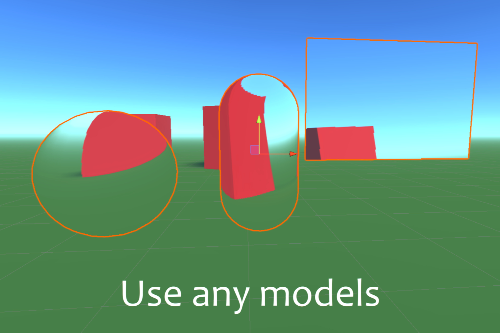

# Simple Zoom Distortion Shader
Shader for distorting the image behind the material.

Use this asset if you need to create a magnification effect behind a 3D object.

📌 The magnification system uses specially written shaders to optimize rendering calls. This means that adding this effect to your project will not cause problems with a drop in the number of frames per second.

Supported platforms: Android/IOS/PC

Shader count: 1

Documentation: Included

# Screenshots

